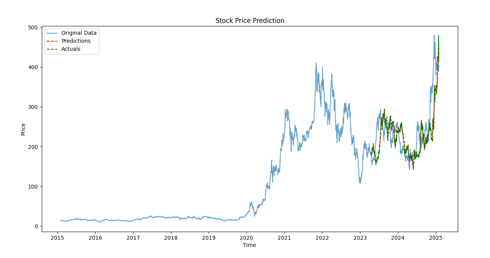

# tesla-lstm-predictor
이 프로젝트는 LSTM(Long Short-Term Memory) 모델을 사용하여 Tesla (TSLA) 주가를 예측하는 예제입니다. Yahoo Finance에서 TSLA의 역사적 데이터를 다운로드하여 데이터 전처리, 시퀀스 생성, 모델 학습, 평가 및 시각화를 수행합니다.

### 주요 기능   
데이터 다운로드 및 전처리:   
Yahoo Finance에서 TSLA 주가 데이터를 다운로드하고, `MinMaxScaler`를 사용하여 주요 피처(`Close`, `Volume`, `Open`, `High`, `Low`)를 스케일링합니다.

시퀀스 데이터 생성:   
일정 시간 단위로 시퀀스 데이터를 생성하여 LSTM 모델의 입력으로 사용합니다.

LSTM 모델 정의 및 학습:   
구성 파일(`config.yaml`)에 지정된 하이퍼파라미터에 따라 LSTM 모델을 정의하고, 학습합니다.

모델 평가 및 시각화:   
학습된 모델을 평가하고, 예측 결과와 실제 데이터를 시각화합니다.

모듈화:
코드가 `src` 디렉토리 내 여러 모듈(`utils`, `dataset`, `model`, `train`, `eval`, `visualization`)로 구성되어 있어, 유지보수 및 확장이 용이하도록 하였습니다. 


### 파일 구조
```bash
.
├── configs
│   └── config.yaml       # 학습 및 로깅 관련 설정 파일
├── main.py               # 프로젝트 진입점
└── src
    ├── dataset.py        # 데이터 다운로드 및 전처리 모듈
    ├── eval.py           # 모델 평가 모듈
    ├── model.py          # LSTM 모델 정의 모듈
    ├── train.py          # 모델 학습 모듈
    ├── utils.py          # 유틸리티 함수 (설정 로드, 로깅 설정 등)
    └── visualization.py  # 결과 시각화 모듈

```

### 설치 방법
1. 레포지토리 클론   
터미널에서 아래 명령어를 실행하여 레포지토리를 클론합니다.

```bash
git clone https://github.com/MachuEngine/tesla-lstm-predictor.git
cd tesla-lstm-predictor
```

2. 의존성 설치   
Python 3.10 이상 버전을 사용하고, 필요한 패키지를 설치합니다.
```
pip install -r requirements.txt

```

### 설정
* configs/config.yaml   
이 파일은 데이터 경로, 학습 하이퍼파라미터(에포크 수, 학습률, 입력/출력 크기, hidden size 등), 로깅 설정, 체크포인트 저장 간격 등을 정의합니다.

```yaml
data:
  path: "./data"

train:
  num_epochs: 200
  learning_rate: 0.001
  input_size: 5
  hidden_size: 64
  num_layers: 2
  output_size: 1

logging:
  level: INFO
  file: "./logs/train.log"

checkpoint:
  directory: "./checkpoints"
  save_interval: 5
```

### 모델
순차데이터 처리를 위해 LSTM 모델을 이용합니다. Config에서 정의한 것과 같이 hidden_size는 64이며, num_layers는 2로 구성됩니다.   
```py
import torch
import torch.nn as nn

class LSTMModel(nn.Module):
    def __init__(self, input_size, hidden_size, num_layers, output_size, dropout=0.2):
        super(LSTMModel, self).__init__()
        self.hidden_size = hidden_size
        self.num_layers = num_layers
        self.lstm = nn.LSTM(input_size, hidden_size, num_layers, batch_first=True, dropout=dropout)
        self.fc = nn.Linear(hidden_size, output_size)

    def forward(self, x):
        h0 = torch.zeros(self.num_layers, x.size(0), self.hidden_size).to(x.device)
        c0 = torch.zeros(self.num_layers, x.size(0), self.hidden_size).to(x.device)
        out, _ = self.lstm(x, (h0, c0))
        out = out[:, -1, :]  # 마지막 타임스텝의 출력만 사용
        out = self.fc(out)  # 출력층에 활성화 함수 없음
        return out
```

### 사용 방법

1. 메인 스크립트 실행   
터미널에서 다음 명령어를 실행하여 프로젝트를 시작합니다.

```bash
python main.py
```
main.py에서는 src/utils.py의 설정 로드 및 로깅 설정,   
src/dataset.py의 데이터 다운로드 및 전처리,   
src/model.py의 LSTM 모델 생성,   
src/train.py의 모델 학습,   
src/eval.py의 평가,   
src/visualization.py의 결과 시각화를 순차적으로 호출합니다.   

2. 결과 확인   
학습이 완료되면, 터미널에 학습 손실과 예측 결과가 출력되며, 시각화된된 예측 값과 실제 값의 비교 그래프를 확인할 수 있습니다.   

```
(stt_env) C:\Users\Admin\Documents\Projects\tesla-lstm-predictor>python main.py
[*********************100%***********************]  1 of 1 completed
y_train min: 0.0, max: 1.0
y_test min: 0.33085575699806213, max: 1.1745538711547852

Epoch 10/200, Loss: 0.000733
Epoch 20/200, Loss: 0.000534
Epoch 30/200, Loss: 0.000500
Epoch 40/200, Loss: 0.000446
Epoch 50/200, Loss: 0.000429
Epoch 60/200, Loss: 0.000325
...
Epoch 150/200, Loss: 0.000296
Epoch 160/200, Loss: 0.000297
Epoch 170/200, Loss: 0.000275
Epoch 180/200, Loss: 0.000278
Epoch 190/200, Loss: 0.000274
Epoch 200/200, Loss: 0.000277

Predictions before inverse transform: [[0.41361004]
 [0.42765713]
 [0.4317749 ]
 [0.4369152 ]
 [0.43686327]
 [0.43586728]
 [0.4569445 ]
 [0.4678345 ]
 [0.46752587]
 [0.46044657]]

Predictions range after inverse transform: 145.84637451171875 to 456.5382385253906
Actuals range after inverse transform: 142.0500030517578 to 479.8599853515625
Predictions after inverse transform: [[175.18414]
 [180.80849]
 [182.45721]
 [184.51535]
 [184.49455]
 [184.09576]
 [192.53491]
 [196.89519]
 [196.77162]
 [193.93712]]

Original data range: Ticker
TSLA    9.578
dtype: float64 to Ticker
TSLA    479.859985
dtype: float64
```


### 라이선스
이 프로젝트는 MIT 라이선스 하에 배포됩니다.
